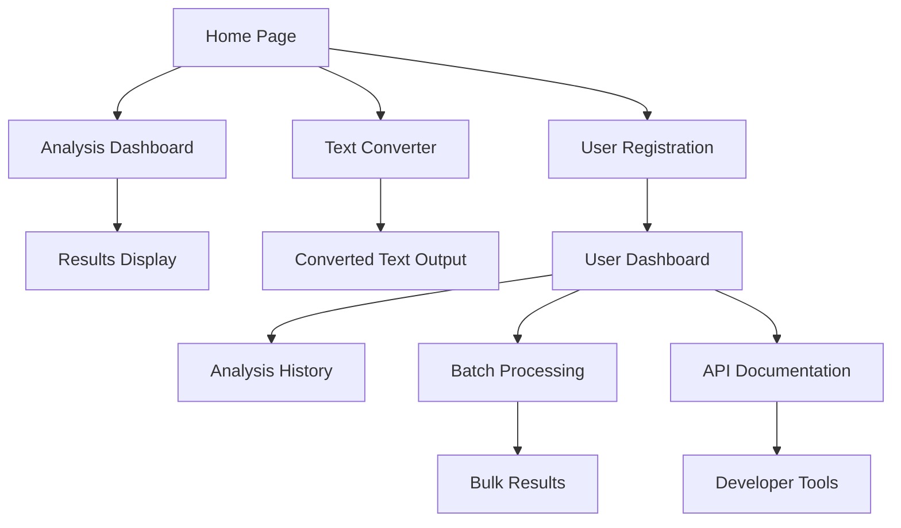

# AI Content Detection Platform - Product Requirements Document

## 1. Product Overview

AI Content Detection Platform is a comprehensive web application that leverages machine learning to identify AI-generated text with 97.49% accuracy using a trained Naive Bayes classifier. The platform provides real-time text analysis, AI-to-human text conversion, and enterprise-grade features for content authenticity verification.

The platform addresses the growing need for content authenticity in academic institutions, publishing companies, and businesses to maintain content integrity and combat AI-generated misinformation.

## 2. Core Features

### 2.1 User Roles

| Role | Registration Method | Core Permissions |
|------|---------------------|------------------|
| Guest User | No registration required | Basic text analysis (limited to 500 words) |
| Registered User | Email registration | Full text analysis, history tracking, export features |
| Premium User | Subscription upgrade | Batch processing, API access, advanced analytics |
| Admin | System invitation | User management, system analytics, model updates |

### 2.2 Feature Module

Our AI Content Detection Platform consists of the following main pages:

1. **Home Page**: Hero section with live demo, feature highlights, accuracy statistics, and user testimonials.
2. **Analysis Dashboard**: Real-time text analysis interface, confidence scoring, detailed results visualization.
3. **Text Converter**: AI-to-human text transformation tool with style options and quality metrics.
4. **Batch Processing**: Multi-document analysis interface with progress tracking and bulk export.
5. **User Dashboard**: Account management, analysis history, usage statistics, and subscription details.
6. **API Documentation**: Developer resources, endpoint documentation, and integration guides.

### 2.3 Page Details

| Page Name | Module Name | Feature description |
|-----------|-------------|---------------------|
| Home Page | Hero Section | Display platform accuracy (97.49%), live text analysis demo, feature overview |
| Home Page | Statistics Panel | Show real-time usage metrics, total analyses performed, user testimonials |
| Home Page | Pricing Section | Display subscription tiers, feature comparison, call-to-action buttons |
| Analysis Dashboard | Text Input Area | Accept text input up to 10,000 words, paste/upload file options, character counter |
| Analysis Dashboard | Results Panel | Display AI/Human classification, confidence percentage, detailed analysis breakdown |
| Analysis Dashboard | Visualization | Show probability charts, text statistics, highlighted suspicious sections |
| Text Converter | Input Interface | Accept AI-generated text, conversion style selection (formal, casual, academic) |
| Text Converter | Processing Engine | Transform AI text to human-like writing, maintain original meaning, quality scoring |
| Text Converter | Output Display | Show converted text, comparison view, readability metrics, export options |
| Batch Processing | File Upload | Support multiple file formats (PDF, DOCX, TXT), drag-drop interface, progress tracking |
| Batch Processing | Queue Management | Display processing status, estimated completion time, batch results summary |
| Batch Processing | Export Tools | Generate comprehensive reports, CSV/Excel export, detailed analytics |
| User Dashboard | Account Settings | Profile management, password change, notification preferences, subscription status |
| User Dashboard | Analysis History | Searchable history, result filtering, re-analysis options, bookmark favorites |
| User Dashboard | Usage Analytics | Monthly usage charts, accuracy trends, most analyzed content types |
| API Documentation | Endpoint Guide | RESTful API documentation, authentication methods, rate limiting details |
| API Documentation | Code Examples | Sample implementations in multiple languages, SDK downloads, testing tools |

## 3. Core Process

**Guest User Flow:**
Users can immediately access the platform and analyze short text samples without registration. After experiencing the basic functionality, they're encouraged to register for enhanced features.

**Registered User Flow:**
Users sign up, verify email, and gain access to full analysis capabilities, history tracking, and text conversion features. They can upgrade to premium for advanced functionality.

**Premium User Flow:**
Premium users access batch processing, API endpoints, and advanced analytics. They can integrate the platform into their existing workflows through API calls.

**Admin Flow:**
Administrators monitor system performance, manage user accounts, update the ML model, and access comprehensive platform analytics.

## 4. User Interface Design

### 4.1 Design Style

- **Primary Colors**: Deep Blue (#1e3a8a) for trust and reliability, Bright Green (#10b981) for success states
- **Secondary Colors**: Light Gray (#f8fafc) for backgrounds, Dark Gray (#374151) for text
- **Button Style**: Rounded corners (8px radius), subtle shadows, hover animations with color transitions
- **Typography**: Inter font family, 16px base size, clear hierarchy with 24px/32px/48px headings
- **Layout Style**: Clean card-based design, generous white space, responsive grid system
- **Icons**: Heroicons style, consistent 24px size, outlined for secondary actions, filled for primary

### 4.2 Page Design Overview

| Page Name | Module Name | UI Elements |
|-----------|-------------|-------------|
| Home Page | Hero Section | Large gradient background, centered content, animated statistics counter, CTA button with pulse effect |
| Home Page | Demo Section | Interactive text input box, real-time analysis preview, confidence meter with color coding |
| Analysis Dashboard | Input Panel | Clean textarea with syntax highlighting, file upload dropzone, character limit indicator |
| Analysis Dashboard | Results Panel | Progress spinner during analysis, confidence gauge (0-100%), color-coded classification badges |
| Text Converter | Interface | Side-by-side comparison layout, style selector dropdown, quality score visualization |
| Batch Processing | Upload Area | Drag-drop zone with file icons, progress bars for each file, batch summary cards |
| User Dashboard | Navigation | Sidebar navigation with icons, breadcrumb trail, quick action buttons |
| API Documentation | Code Blocks | Syntax-highlighted code examples, copy-to-clipboard buttons, interactive API tester |

### 4.3 Responsiveness

The platform is mobile-first responsive, optimizing for desktop productivity while ensuring full functionality on tablets and smartphones. Touch interactions are optimized for mobile analysis and file uploads, with swipe gestures for navigation between analysis results.
