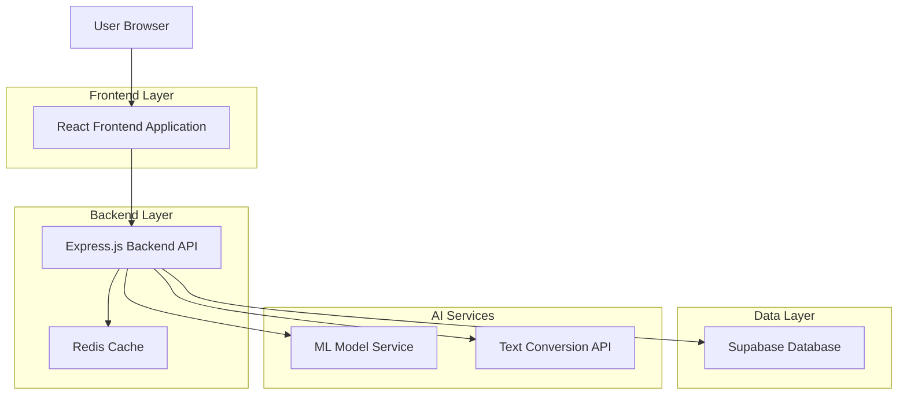
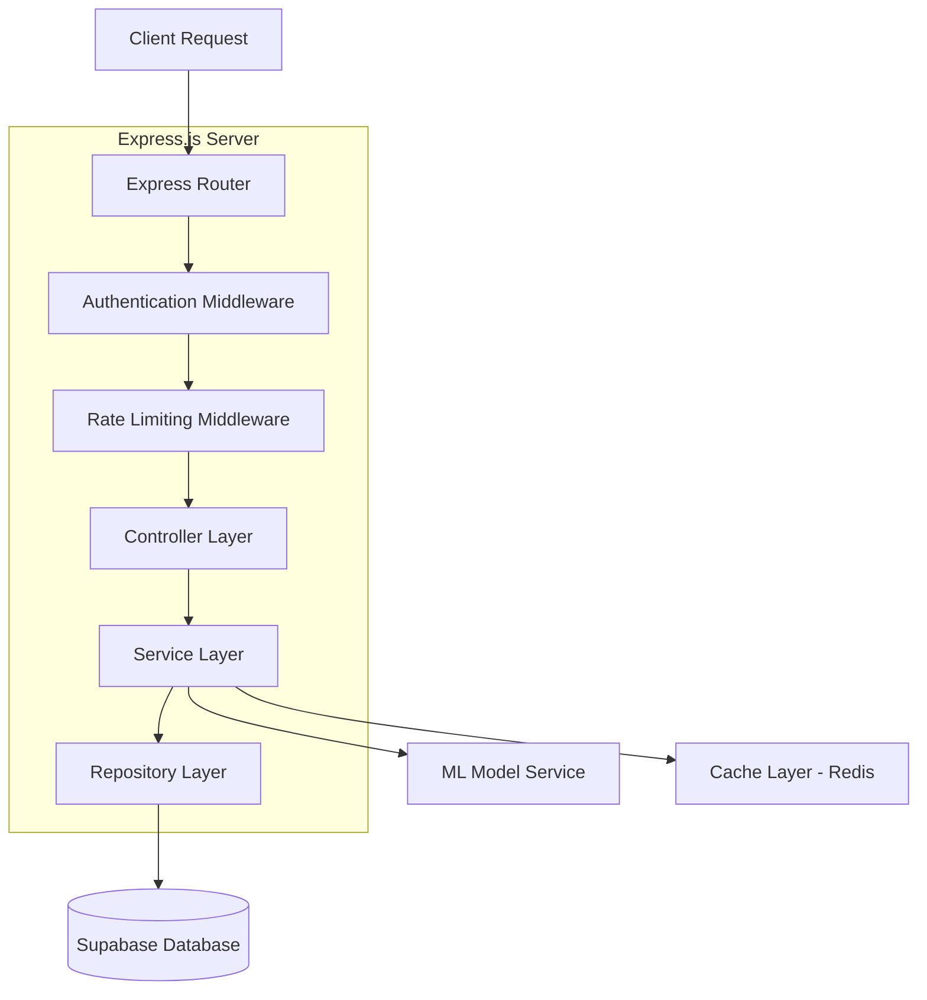
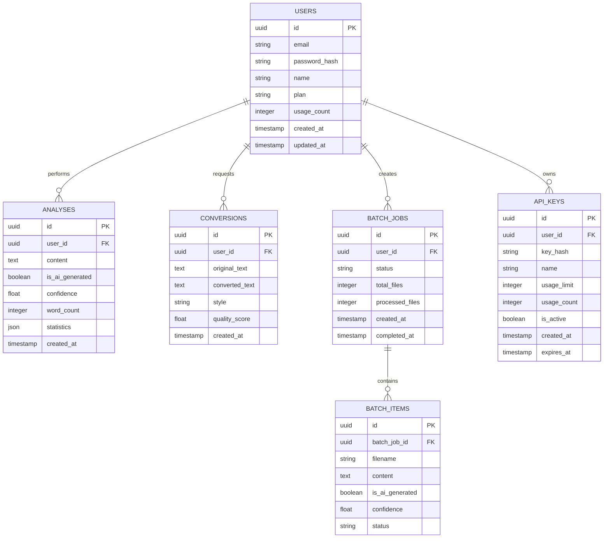

# AI Content Detection Platform - Technical Architecture Document

## 1. Architecture Design



## 2. Technology Description

- **Frontend**: React@18 + TypeScript + Tailwind CSS + Vite + React Router + React Query
- **Backend**: Express.js@4 + TypeScript + Node.js@18
- **Database**: Supabase (PostgreSQL)
- **Caching**: Redis@7
- **ML Framework**: Python Flask microservice with scikit-learn
- **Authentication**: Supabase Auth
- **File Storage**: Supabase Storage
- **Deployment**: Docker containers

## 3. Route Definitions

| Route | Purpose |
|-------|---------|
| / | Home page with hero section and live demo |
| /analyze | Main analysis dashboard for text input and results |
| /convert | AI-to-human text conversion interface |
| /batch | Batch processing interface for multiple documents |
| /dashboard | User dashboard with history and analytics |
| /api-docs | API documentation and developer resources |
| /login | User authentication page |
| /register | User registration page |
| /pricing | Subscription plans and pricing information |
| /profile | User profile and account settings |

## 4. API Definitions

### 4.1 Core API

**Text Analysis**
```
POST /api/analyze
```

Request:
| Param Name | Param Type | isRequired | Description |
|------------|------------|------------|--------------|
| text | string | true | Text content to analyze (max 10,000 chars) |
| userId | string | false | User ID for history tracking |

Response:
| Param Name | Param Type | Description |
|------------|------------|-------------|
| isAiGenerated | boolean | Classification result (true = AI, false = Human) |
| confidence | number | Confidence score (0-100) |
| analysisId | string | Unique analysis identifier |
| timestamp | string | Analysis timestamp |
| wordCount | number | Total word count |
| statistics | object | Detailed text statistics |

Example:
```json
{
  "text": "This is a sample text to analyze for AI detection.",
  "userId": "user_123"
}
```

**Text Conversion**
```
POST /api/convert
```

Request:
| Param Name | Param Type | isRequired | Description |
|------------|------------|------------|--------------|
| text | string | true | AI-generated text to convert |
| style | string | false | Conversion style (formal, casual, academic) |
| userId | string | false | User ID for tracking |

Response:
| Param Name | Param Type | Description |
|------------|------------|-------------|
| convertedText | string | Human-like converted text |
| qualityScore | number | Conversion quality (0-100) |
| originalLength | number | Original text length |
| convertedLength | number | Converted text length |
| conversionId | string | Unique conversion identifier |

**Batch Processing**
```
POST /api/batch/upload
```

Request:
| Param Name | Param Type | isRequired | Description |
|------------|------------|------------|--------------|
| files | File[] | true | Array of files to process |
| userId | string | true | User ID for batch tracking |

Response:
| Param Name | Param Type | Description |
|------------|------------|-------------|
| batchId | string | Unique batch identifier |
| fileCount | number | Number of files uploaded |
| estimatedTime | number | Estimated processing time (seconds) |
| status | string | Batch status (queued, processing, completed) |

**User Authentication**
```
POST /api/auth/login
```

Request:
| Param Name | Param Type | isRequired | Description |
|------------|------------|------------|--------------|
| email | string | true | User email address |
| password | string | true | User password |

Response:
| Param Name | Param Type | Description |
|------------|------------|-------------|
| token | string | JWT authentication token |
| user | object | User profile information |
| expiresIn | number | Token expiration time |

## 5. Server Architecture Diagram



## 6. Data Model

### 6.1 Data Model Definition



### 6.2 Data Definition Language

**Users Table**
```sql
-- Create users table
CREATE TABLE users (
    id UUID PRIMARY KEY DEFAULT gen_random_uuid(),
    email VARCHAR(255) UNIQUE NOT NULL,
    password_hash VARCHAR(255) NOT NULL,
    name VARCHAR(100) NOT NULL,
    plan VARCHAR(20) DEFAULT 'free' CHECK (plan IN ('free', 'premium', 'enterprise')),
    usage_count INTEGER DEFAULT 0,
    created_at TIMESTAMP WITH TIME ZONE DEFAULT NOW(),
    updated_at TIMESTAMP WITH TIME ZONE DEFAULT NOW()
);

-- Grant permissions
GRANT SELECT ON users TO anon;
GRANT ALL PRIVILEGES ON users TO authenticated;
```

**Analyses Table**
```sql
-- Create analyses table
CREATE TABLE analyses (
    id UUID PRIMARY KEY DEFAULT gen_random_uuid(),
    user_id UUID REFERENCES users(id) ON DELETE CASCADE,
    content TEXT NOT NULL,
    is_ai_generated BOOLEAN NOT NULL,
    confidence FLOAT NOT NULL CHECK (confidence >= 0 AND confidence <= 100),
    word_count INTEGER NOT NULL,
    statistics JSONB,
    created_at TIMESTAMP WITH TIME ZONE DEFAULT NOW()
);

-- Create indexes
CREATE INDEX idx_analyses_user_id ON analyses(user_id);
CREATE INDEX idx_analyses_created_at ON analyses(created_at DESC);
CREATE INDEX idx_analyses_confidence ON analyses(confidence DESC);

-- Grant permissions
GRANT SELECT ON analyses TO anon;
GRANT ALL PRIVILEGES ON analyses TO authenticated;
```

**Conversions Table**
```sql
-- Create conversions table
CREATE TABLE conversions (
    id UUID PRIMARY KEY DEFAULT gen_random_uuid(),
    user_id UUID REFERENCES users(id) ON DELETE CASCADE,
    original_text TEXT NOT NULL,
    converted_text TEXT NOT NULL,
    style VARCHAR(20) DEFAULT 'formal' CHECK (style IN ('formal', 'casual', 'academic')),
    quality_score FLOAT CHECK (quality_score >= 0 AND quality_score <= 100),
    created_at TIMESTAMP WITH TIME ZONE DEFAULT NOW()
);

-- Create indexes
CREATE INDEX idx_conversions_user_id ON conversions(user_id);
CREATE INDEX idx_conversions_created_at ON conversions(created_at DESC);

-- Grant permissions
GRANT SELECT ON conversions TO anon;
GRANT ALL PRIVILEGES ON conversions TO authenticated;
```

**Batch Jobs Table**
```sql
-- Create batch_jobs table
CREATE TABLE batch_jobs (
    id UUID PRIMARY KEY DEFAULT gen_random_uuid(),
    user_id UUID REFERENCES users(id) ON DELETE CASCADE,
    status VARCHAR(20) DEFAULT 'queued' CHECK (status IN ('queued', 'processing', 'completed', 'failed')),
    total_files INTEGER NOT NULL DEFAULT 0,
    processed_files INTEGER NOT NULL DEFAULT 0,
    created_at TIMESTAMP WITH TIME ZONE DEFAULT NOW(),
    completed_at TIMESTAMP WITH TIME ZONE
);

-- Create batch_items table
CREATE TABLE batch_items (
    id UUID PRIMARY KEY DEFAULT gen_random_uuid(),
    batch_job_id UUID REFERENCES batch_jobs(id) ON DELETE CASCADE,
    filename VARCHAR(255) NOT NULL,
    content TEXT NOT NULL,
    is_ai_generated BOOLEAN,
    confidence FLOAT,
    status VARCHAR(20) DEFAULT 'pending' CHECK (status IN ('pending', 'processed', 'failed')),
    created_at TIMESTAMP WITH TIME ZONE DEFAULT NOW()
);

-- Create indexes
CREATE INDEX idx_batch_jobs_user_id ON batch_jobs(user_id);
CREATE INDEX idx_batch_items_batch_job_id ON batch_items(batch_job_id);

-- Grant permissions
GRANT ALL PRIVILEGES ON batch_jobs TO authenticated;
GRANT ALL PRIVILEGES ON batch_items TO authenticated;
```

**API Keys Table**
```sql
-- Create api_keys table
CREATE TABLE api_keys (
    id UUID PRIMARY KEY DEFAULT gen_random_uuid(),
    user_id UUID REFERENCES users(id) ON DELETE CASCADE,
    key_hash VARCHAR(255) NOT NULL,
    name VARCHAR(100) NOT NULL,
    usage_limit INTEGER DEFAULT 1000,
    usage_count INTEGER DEFAULT 0,
    is_active BOOLEAN DEFAULT true,
    created_at TIMESTAMP WITH TIME ZONE DEFAULT NOW(),
    expires_at TIMESTAMP WITH TIME ZONE
);

-- Create indexes
CREATE INDEX idx_api_keys_user_id ON api_keys(user_id);
CREATE INDEX idx_api_keys_key_hash ON api_keys(key_hash);

-- Grant permissions
GRANT ALL PRIVILEGES ON api_keys TO authenticated;
```

**Initial Data**
```sql
-- Insert sample data for testing
INSERT INTO users (email, password_hash, name, plan) VALUES
('admin@aidetection.com', '$2b$10$example_hash', 'Admin User', 'enterprise'),
('demo@aidetection.com', '$2b$10$example_hash', 'Demo User', 'premium');

INSERT INTO analyses (user_id, content, is_ai_generated, confidence, word_count, statistics)
SELECT 
    (SELECT id FROM users WHERE email = 'demo@aidetection.com'),
    'This is a sample human-written text for demonstration purposes.',
    false,
    85.5,
    11,
    '{"readability_score": 75, "avg_sentence_length": 11}'